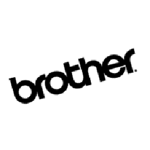

# **Informe: Detección y Clasificación de Logos con HOG**

## **1. Introducción**
Se explica el proceso de implementación de un modelo de detección y clasificación de logos utilizando **Histogram of Oriented Gradients (HOG)** y **Support Vector Machine (SVM)**. Se desarrolló un pipeline que abarca desde la limpieza de datos hasta la clasificación final de los logos en imágenes nuevas.

## **2. Logos Utilizados**
Los logos seleccionados para la clasificación son las siguientes categorias:
- B_brother
- B_Bratz
- D_dc
- D_dell
- Q_qualcom
Ejemplo gráfico:
| Logo | Nombre |
|------|--------|
|  | BROTHER |
|  | BRATZ |
|  | DC |
|  | DELL |
|  | QUALCOMM |

---

## **3. Conceptos Claves**
### **3.1. Histograma de Gradientes Orientados (HOG)**
El **HOG (Histogram of Oriented Gradients)** es un descriptor de características que captura la distribución de gradientes en una imagen, permitiendo extraer información relevante sobre la forma y los bordes de los objetos.

### **3.2. Support Vector Machine (SVM)**
El **SVM (Máquina de Soporte Vectorial)** es un algoritmo de clasificación supervisado que busca una hiperplano óptimo para separar los datos en distintas clases.

### **3.3. Preprocesamiento de Imágenes**
Para mejorar la detección de logos, se aplicaron técnicas de preprocesamiento como:
- **Conversión a escala de grises** para reducir el ruido y la complejidad de la imagen.
- **Ecualización de histograma** para mejorar el contraste.
- **Filtro Gaussiano** para suavizar la imagen.
- **Umbral adaptativo** para mejorar la detección de bordes.

---

## **4. Implementación**
### **4.1. Limpieza y Preparación de Datos**
1. Se recopilaron imágenes de los logos seleccionados.
2. Se dividieron en **positivos (con el logo)** y **negativos (sin el logo)**.
3. Se redimensionaron todas las imágenes a **64x128 píxeles**.
4. Se generó un dataset balanceado.

### **4.2. Extracción de Características con HOG**
Para cada imagen del dataset:
1. Se calculó el **Histograma de Gradientes Orientados (HOG)**.
2. Se almacenaron los descriptores en un archivo para su posterior uso.

### **4.3. Entrenamiento del Modelo SVM**
1. Se entrenó un **SVM multicategoría** con los descriptores HOG extraídos.
2. Se guardó el modelo entrenado en un archivo `svm_model.xml` para su reutilización.

### **4.4. Detección y Clasificación en Imágenes Nuevas**
1. Se preprocesaron las imágenes nuevas (filtro Gaussiano, umbral adaptativo).
2. Se utilizaron **contornos (`findContours`)** para detectar regiones de interés (posibles logos).
3. Para cada región detectada:
   - Se extrajo el **descriptor HOG**.
   - Se clasificó con el **modelo SVM** entrenado.
   - Se dibujó un **rectángulo** alrededor del logo detectado.
   - Se agregó una etiqueta con la **predicción** (o "Desconocido" si no coincide con ningún logo entrenado).

---

## **5. Resultados**
A continuación, se muestra una imagen con los logos detectados y clasificados:

---

## **6. Conclusiones**
- La combinación de **HOG + SVM** permitió una clasificación efectiva de logos en imágenes.
- La precisión del modelo depende en gran medida de la calidad del dataset y el preprocesamiento.
- `findContours()` resultó ser una alternativa funcional a los detectores Haarcascades para identificar regiones de interés en la imagen.
- Se podría mejorar la detección utilizando una mayor cantidad de imágenes de entrenamiento y ajustando los hiperparámetros del modelo SVM.
- 
---

## **8. Referencias**
1. Dalal, N., & Triggs, B. (2005). *Histograms of Oriented Gradients for Human Detection*. IEEE Computer Society Conference on Computer Vision and Pattern Recognition (CVPR).
2. OpenCV Documentation: [https://docs.opencv.org](https://docs.opencv.org)
